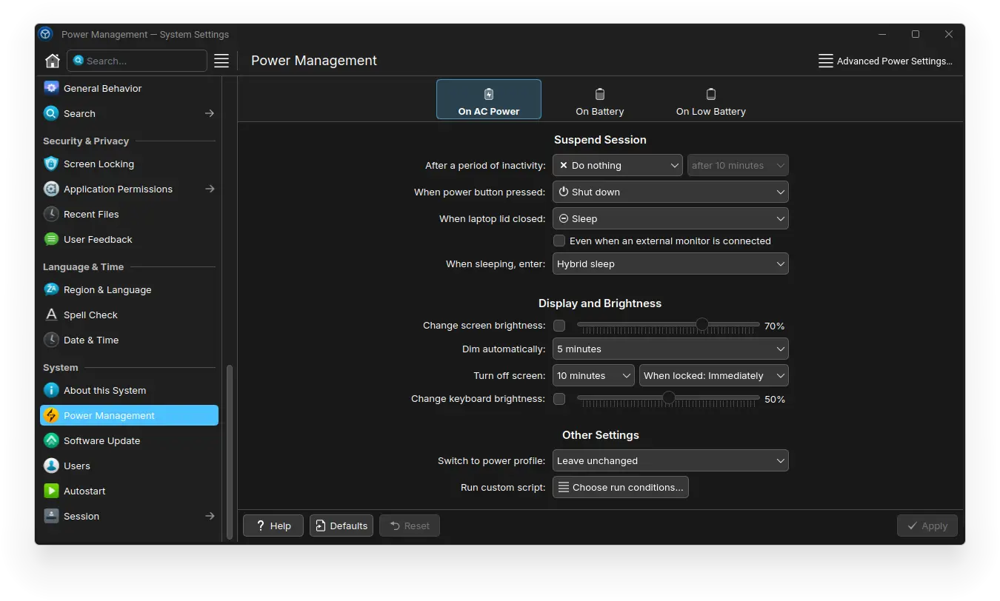

```sh
pacman -S plasma
          colord-kde
          dolphin-plugins
          kcharselect
          kcolorchooser
          kcron
          kdegraphics-thumbnailers
          kdenetwork-filesharing
          kdesdk-thumbnailers
          kdialog
          kfind
          khelpcenter
          kio-admin
          kio-gdrive
          kio-zeroconf
          kio-extras
          kjournald
          kolourpaint
          kompare
          krfb
          ksystemlog
          svgpart
          sweeper
          maliit-keyboard
          flatpak-kcm
```

## Settings

### Appearance & Style

#### Colors & Themes

This is a taste matter. But currently this is what I prefer to use.

- Global Theme: `Breeze`
- Colors: `Willow Dark`
- Application Style: `Breeze`
- Gnome/GTK Application Style: `Windows10`
- Plasma Style: `Windows-Eleven-Dark`
- Window Decorations: `Willow Dark Alt`
- Icons: `Kora`
- Cursors: `Adwaita`
- Splash Screen: `None`
- Login Screen (SDDM): `Breeze` might want to change the background to something else. Also recommended to run `Apply Plasma Settings...`.

#### Text & Fonts

- General: `Inter 10pt`
- Fixed Width: `RobotoMono Font Mono Md [GOOG] 10pt`
- Small: `Inter 8pt`
- Toolbar: `Roboto 10pt`
- Menu: `Roboto 10pt`
- Window Title: `Roboto 10pt`
- Anti-Aliasing: Enabled

### Security & Privacy

#### Screen Locking

- Lock screen automatically: Never
- Lock after waking from sleep: Enabled
- Delay before password required: Require password immediately

### Language & Time

#### Region & Language

- Language: `American English`
- Numbers: `American English (United States)`
- Time: `English (Ireland)`
- Currency: `English (Ireland)`
- Measurement: `English (Ireland)`
- Paper Size: `English (Ireland)`
- Address: `English (Ireland)`
- Name Style: `English (Ireland)`
- Phone Numbers: `Deutsch (Deutschland)`

### System

#### Power Management




