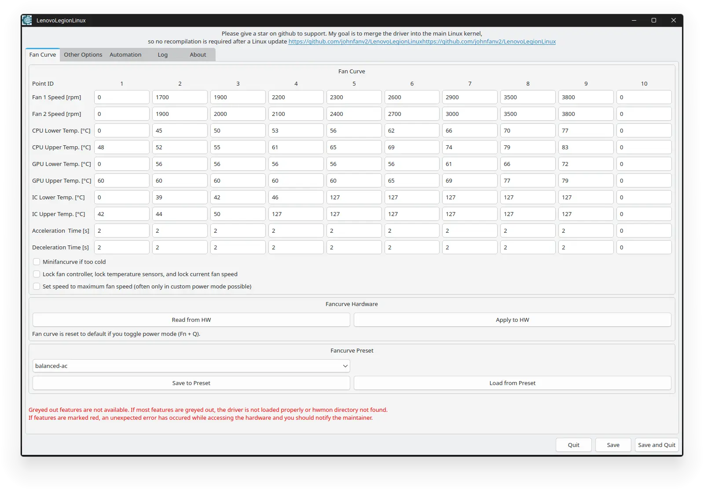
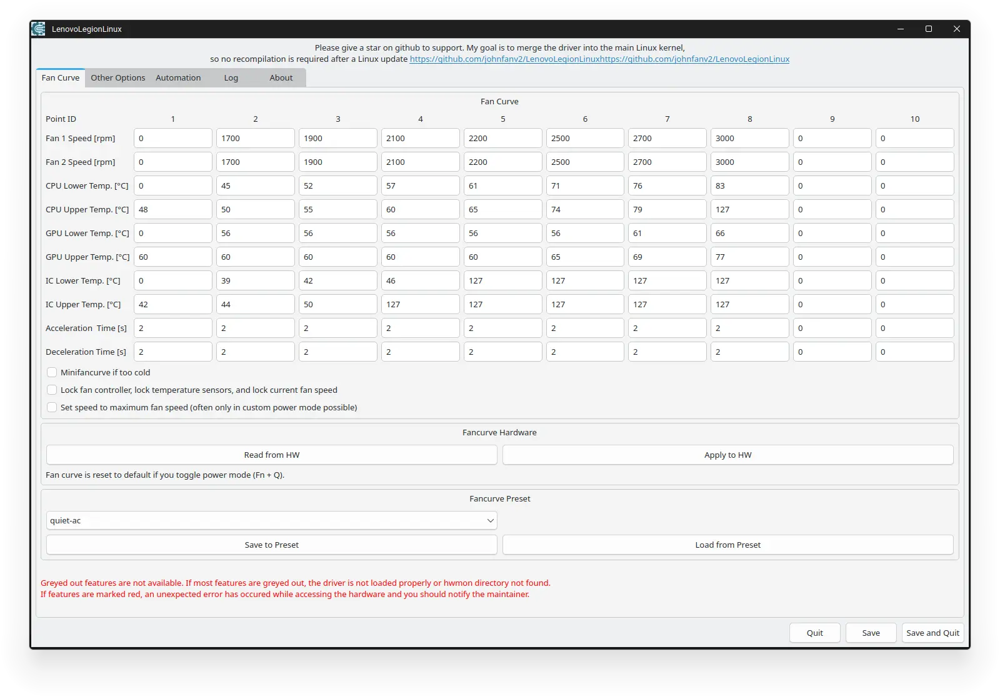

import { Aside } from '@astrojs/starlight/components';

```sh
paru -S lenovolegionlinux-dkms-git
```

will get you all the necessary bits than you need to build the kernel module. After setting the fan speeds and saving them to presets you can start the power service with

```sh
sudo systemctl enable --now legiond.service
```

<Aside type="note">
You need [power-profiles-daemon](https://archlinux.org/packages/extra/x86_64/power-profiles-daemon/) to be installed and running for the service to work.
</Aside>






If you want to apply extra settings on power profile you can edit the env file such as:

```ini frame="terminal" title="/etc/legion_linux/legiond.ini"
[main]
# enable fancurve-control
fan_control=true
# enable cpu_control
cpu_control=true
# set nvidia to enable nvidia support
# set radeon to enable amdgpu support
# set false to disable gpu_control
gpu_control=false

[gpu_control]
tdp_bat_q=55
tdp_ac_q=80

tdp_bat_b=55
tdp_ac_b=125

tdp_bat_bp=80
tdp_ac_bp=140

tdp_ac_p=140

[cpu_control]
bat_q=ryzenadj --tctl-temp=85 --stapm-limit=20000 --slow-limit=20000 --stapm-time=30 --fast-limit=20000 --slow-time=5
ac_q=ryzenadj --tctl-temp=85 --stapm-limit=25000 --slow-limit=50000 --stapm-time=30 --fast-limit=50000 --slow-time=5

bat_b=ryzenadj --tctl-temp=85 --stapm-limit=25000 --slow-limit=35000 --stapm-time=30 --fast-limit=45000 --slow-time=5
ac_b=ryzenadj --tctl-temp=85 --stapm-limit=55000 --slow-limit=60000 --stapm-time=30 --fast-limit=65000 --slow-time=5

bat_bp=ryzenadj --tctl-temp=85 --stapm-limit=25000 --slow-limit=35000 --stapm-time=30 --fast-limit=45000 --slow-time=5
ac_bp=ryzenadj --tctl-temp=85 --stapm-limit=65000 --slow-limit=70000 --stapm-time=30 --fast-limit=75000 --slow-time=5

ac_p=ryzenadj --tctl-temp=85 --stapm-limit=70000 --slow-limit=75000 --stapm-time=30 --fast-limit=85000 --slow-time=5
```

```sh
systemctl enable --now legiond.service legiond-onresume.service legiond-cpuset.timer
```
