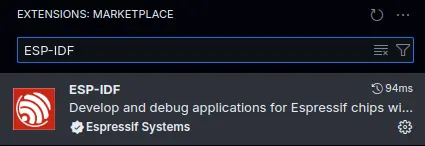
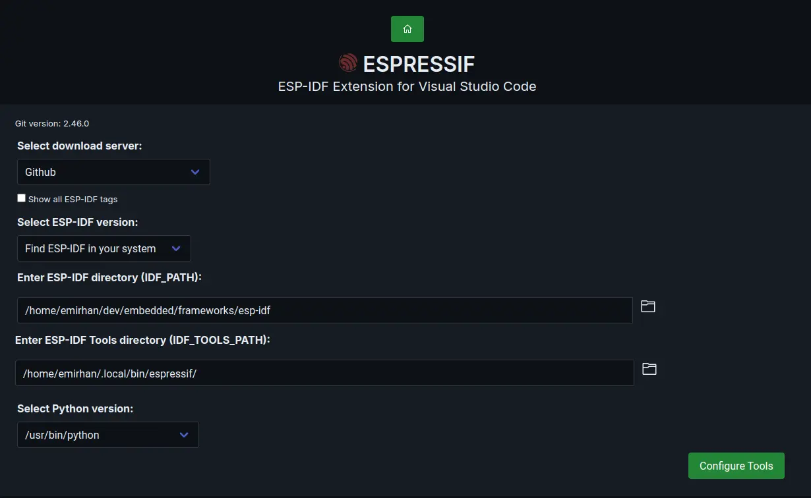
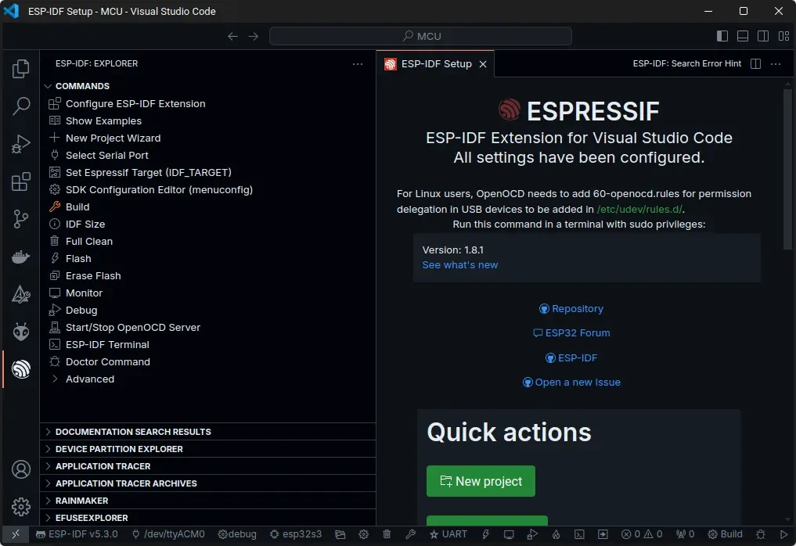
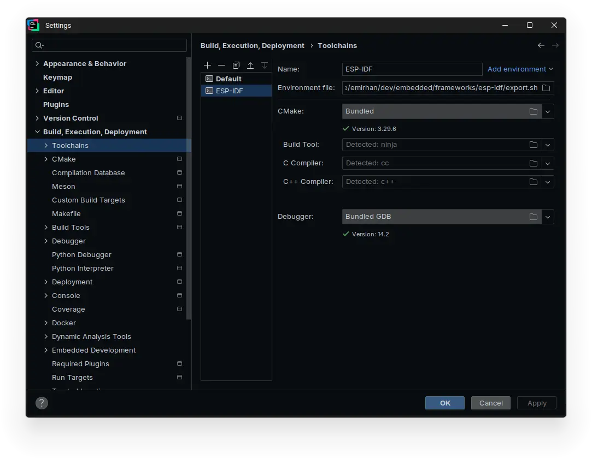
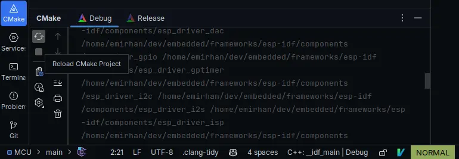

import { Steps, Aside, Tabs, TabItem } from '@astrojs/starlight/components';

As a part of the [THA-LPRD](https://github.com/THA-LPRD) project, we were using the Seeed Studio XIAO ESP32S3 board for the development of the project. In this guide, you will find how we have configured the development environment for the board.

## Prerequisites

- [ESP-IDF](https://idf.espressif.com/)


### ESP-IDF

The ESP-IDF is the official development framework for the ESP32 SoCs. It is based on FreeRTOS and uses CMake build system. It can be installed on Windows, Linux and macOS. Here we are going to cover the Linux installation but feel free to check the [Windows installation guide](https://docs.espressif.com/projects/esp-idf/en/stable/esp32/get-started/windows-setup.html) or the [Linux and macOS installation guide](https://docs.espressif.com/projects/esp-idf/en/stable/esp32/get-started/linux-macos-setup.html) in the official documentation.

<Steps>
    1. Install the required packages for the ESP-IDF installation.

        <Tabs>
            <TabItem label="Ubuntu and Debian">
                ```sh
                sudo apt-get install git wget flex bison gperf python3 python3-pip python3-venv cmake ninja-build ccache libffi-dev libssl-dev dfu-util libusb-1.0-0
                ```
            </TabItem>
            <TabItem label="CentOS 7 & 8">
                ```sh
                sudo yum -y update && sudo yum install git wget flex bison gperf python3 cmake ninja-build ccache dfu-util libusbx
                ```
            </TabItem>
            <TabItem label="Arch">
                ```sh
                sudo pacman -S --needed gcc git make flex bison gperf python cmake ninja ccache dfu-util libusb
                ```
                </TabItem>
        </Tabs>

        <Aside type="note">
            CMake version 3.20 or later is required. You can check the version with `cmake --version`. If you have an older version, you should install it manually.
        </Aside>

    2. Clone the ESP-IDF repository.

        ```sh
        mkdir -p ~/dev/embedded/frameworks/ESP-IDF
        cd ~/dev/embedded/frameworks/ESP-IDF
        git clone -b v5.3 --recursive https://github.com/espressif/esp-idf.git
        ```

        <Aside type="note">
            Directory structure is just a suggestion. Feel free to tailor to your needs. Just don't forget to update the paths in the fallowing steps.
        </Aside>

    3. Set up the tools.

        <Tabs>
            <TabItem label="Bash and Zsh">
                ```sh
                cd esp-idf
                export IDF_TOOLS_PATH="$HOME/dev/embedded/frameworks/ESP-IDF/espressif"
                ./install.sh esp32s3
                ```
            </TabItem>
            <TabItem label="fish">
                ```sh
                cd esp-idf
                set -x IDF_TOOLS_PATH "$HOME/dev/embedded/frameworks/ESP-IDF/espressif"
                ./install.fish esp32s3
                ```
            </TabItem>
        </Tabs>

    4. Set up the environment variables.

        ```sh
        source ./export.sh
        ```
</Steps>

## Setup Development Environment

Now that you have installed all the necessary tools, we can start setting up the necessary bits to be able to develop for the board.

First, we need to clone the repository that contains the necessary scripts and files to work with the board.

```sh
git clone --recurse-submodules https://github.com/THA-LPRD/MCU.git
```

And navigate to the directory.

```sh
cd MCU
```

### Build the Firmware

You can build the firmware for the board with the fallowing command.

<Tabs syncKey="PROJ_PROFILE">
    <TabItem label="Debug">
        ```sh
        idf.py @profiles/debug/debug build
        ```
    </TabItem>
    <TabItem label="Release">
        ```sh
        idf.py @profiles/release/release build
        ```
    </TabItem>
</Tabs>

This will build the firmware for the board with the specified profile in the `build` directory under respective profile directory.

### Flash the Firmware

You can flash the firmware to the board with the fallowing command.

<Tabs syncKey="PROJ_PROFILE">
    <TabItem label="Debug">
        ```sh
        idf.py @profiles/debug/debug flash
        ```
    </TabItem>
    <TabItem label="Release">
        ```sh
        idf.py @profiles/debug/release flash
        ```
    </TabItem>
</Tabs>

### Monitor the Output

You can monitor the output of the board with the fallowing command

<Tabs syncKey="PROJ_PROFILE">
    <TabItem label="Debug">
        ```sh
        idf.py @profiles/debug/debug monitor
        ```
    </TabItem>
    <TabItem label="Release">
        ```sh
        idf.py @profiles/debug/release monitor
        ```
    </TabItem>
</Tabs>

### Clean the Build

You can clean the build with the fallowing command.


<Tabs syncKey="PROJ_PROFILE">
    <TabItem label="Debug">
        ```sh
        idf.py @profiles/debug/debug fullclean
        ```
    </TabItem>
    <TabItem label="Release">
        ```sh
        idf.py @profiles/debug/release fullclean
        ```
    </TabItem>
</Tabs>

You can just remove the build directory too

## Optional Tools

To optimize your development workflow, here are some practical tips for effectively utilizing Visual Studio Code and CLion.

### Visual Studio Code

Espressif offers a VS Code extension for working with ESP-IDF projects. The repository already contains the necessary configuration files; you just need to set up the extension itself.

<Steps>
    1. Install the `ESP-IDF` extension.

        

    2. Open command palette with <kbd>Ctrl+Shift+P</kbd> and choose `ESP-IDF: Configure ESP-IDF Extension. Select Advanced and fill the fields to match your setup.

        

    3. Select `Use existing ESP-IDF Tools` from dropdown and save the settings.
</Steps>

IntelliSense and other features should now work. To build, flash, and monitor the firmware, you can use the extension panel or the buttons in the status bar. Additionally, you can change the build profile as needed.



### CLion

Clion natively supports CMake projects. We just need to configure the project to use the ESP-IDF toolchain.

<Steps>
    1. Go to Settings | Build, Execution, Deployment | Toolchain.

    2. Click Add environment next to the Name field, then click From file.

    3. Navigate to ~/dev/embedded/frameworks/ESP-IDF/esp-idf and select export.sh:

        

    4. Save the toolchain settings.
</Steps>

Project should come with necessary CMake profiles for the project. If you need to edit them these can be found under Settings | Build, Execution, Deployment | CMake.

If you removed the build directory, or it's not generated yet, you can generate it from CMake tab | Reload CMake Project.



#### Build the Firmware

Select the desired profile and CMake target `app` and click the hammer icon to build the firmware.

#### Flash the Firmware

Select the desired profile and CMake target `flash` and click the hammer icon to build the firmware.

#### Monitor the Output

Select the desired profile and CMake target `monitor` and click the hammer icon to build the firmware.

## See also

- https://docs.espressif.com/projects/esp-idf/en/stable/esp32/get-started/linux-macos-setup.html#get-started-prerequisites
- https://docs.espressif.com/projects/esp-idf/en/latest/esp32/api-guides/build-system.html
- https://github.com/espressif/esp-idf/blob/6e5414b6/examples/build_system/cmake/multi_config/README.md
- https://www.jetbrains.com/help/clion/esp-idf.html
- https://github.com/microsoft/vscode-cmake-tools/blob/main/docs/README.md
- https://github.com/espressif/vscode-esp-idf-extension/blob/master/docs/tutorial/multiple_config.md
- https://docs.espressif.com/projects/esp-idf/en/v4.2.3/esp32/get-started/vscode-setup.html
- https://github.com/espressif/vscode-esp-idf-extension/blob/master/docs/tutorial/install.md
